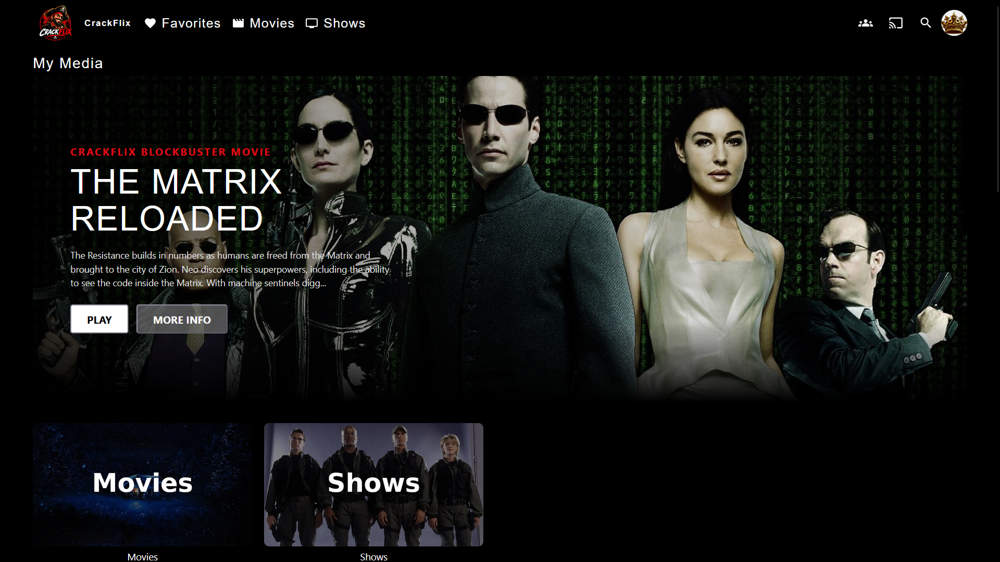
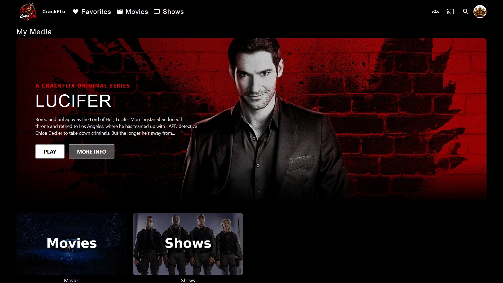
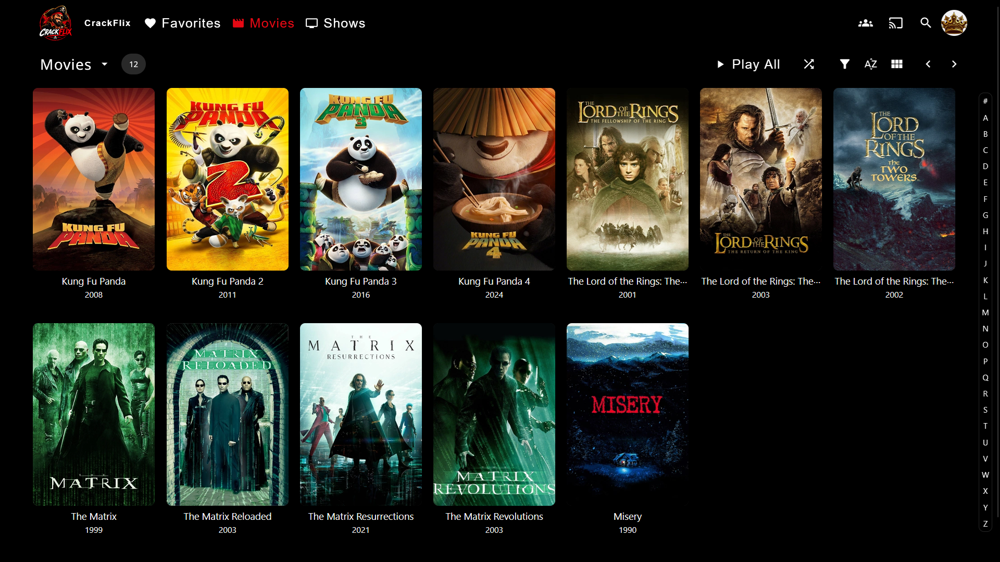
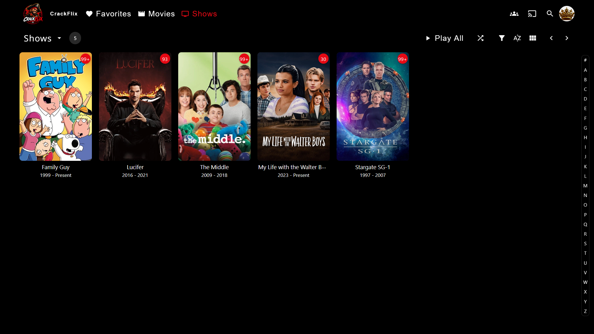
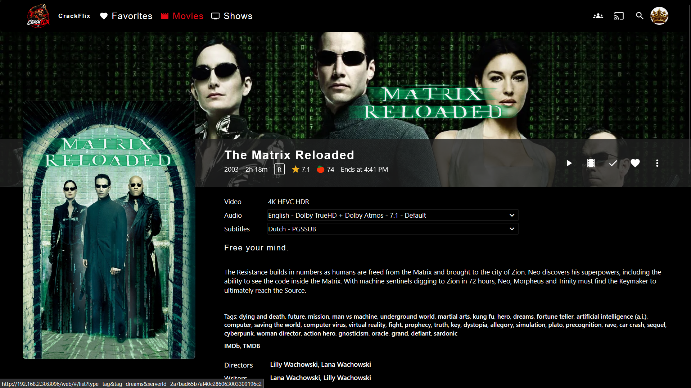
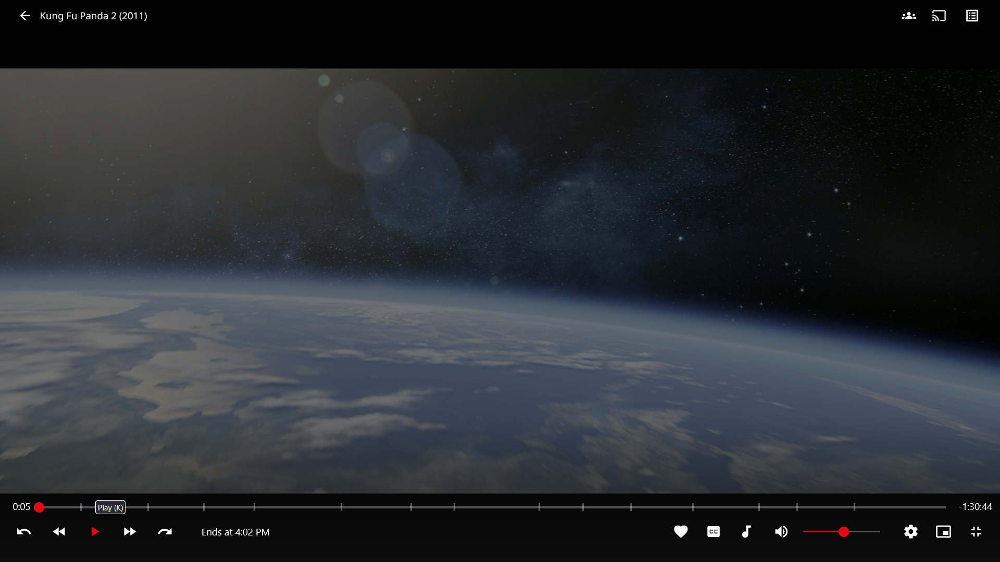
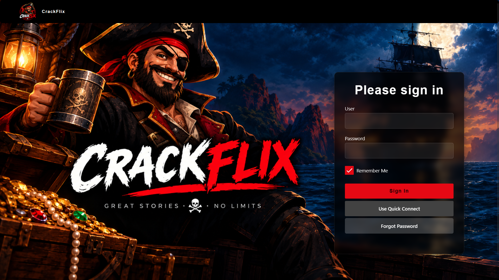

# CrackFlix alpha 0.1.0

**A Netflix-inspired theme for Jellyfin**

CrackFlix is a custom Jellyfin theme designed to give Jellyfin a darker, more cinematic and Netflix-inspired interface while keeping the underlying Jellyfin functionality intact.

Version **0.1.0-alpha** is the first public release of CrackFlix.

---

## 📸 Screenshots

Screenshots shown below are from the **Jellyfin Web interface**, which is the primary visual reference for CrackFlix.

### Home — Movie Hero



### Home — Series Hero



### Movies



### Shows



### Movie Details



### Video Player



### Login



---

## ✨ Features

### Netflix-inspired interface

* Dark, cinematic interface
* CrackFlix red accent color
* Customized navigation and header
* Customized buttons and interactive elements
* Styled media cards and poster hover effects
* Customized progress bars and sliders
* Customized dialogs, popups and controls
* Customized login interface

### Dynamic Hero Banner

CrackFlix adds a dynamic Hero banner to the Jellyfin home page.

The Hero:

* Automatically selects a movie or series from the Jellyfin library
* Uses the item's backdrop image
* Displays the title and description
* Shows whether the selected item is a movie or series
* Includes **PLAY** and **MORE INFO** buttons
* Integrates with Jellyfin's existing item navigation

The Hero is designed to work with Jellyfin's dynamically rendered interface.

### Video Player

CrackFlix adds a custom episode button and visual episode panel to the Jellyfin video player.

The current 0.1.0-alpha implementation is **visual only**. The episode-selection functionality itself has not yet been implemented.

The panel currently serves as the visual foundation for a future episode-selection feature.

### Cross-platform design

CrackFlix has been tested on multiple Jellyfin clients.

Tested platforms include:

* PC Web Browser
* Jellyfin Media Player
* Mobile Web Browser
* Jellyfin Mobile App
* Xbox One
* Xbox Series S

The appearance may differ between Jellyfin clients because different clients use different rendering systems and interfaces.

The primary design reference for CrackFlix is the **Jellyfin web interface**.

---

## 🎨 Optional Visual Assets

CrackFlix 0.1.0-alpha includes visual assets for users who want the complete CrackFlix appearance.

The `assets` folder contains:

* CrackFlix logo
* CrackFlix login splash screen

These assets currently require **separate installation**.

The logo is installed using a **Custom Logo plugin**, while the login splash screen can be configured through Jellyfin's **Dashboard → Branding** settings.

The assets are not automatically installed or applied by the CrackFlix CSS and JavaScript files.

### Important

A manual setup is currently required to achieve the same visual appearance as the developer's CrackFlix setup.

A future version may integrate these assets more directly into the installation process to make CrackFlix more **plug & play**.

---

## 📦 Installation

CrackFlix 0.1.0 consists of a CSS file, a JavaScript file and optional visual assets.

```text
CrackFlix alpha 0.1.0/

├── CrackFlix alpha 0.1.0 stable release all platforms.css

├── CrackFlix alpha 0.1.0 stable release all platforms java.js

├── README.md

├── CHANGELOG.md

├── LICENSE

└── assets/

    ├── crackflix-logo.png

    └── crackflix-login-splash.png
```

### 1. Install the CSS

Copy the contents of:

```text
CrackFlix alpha 0.1.0 stable release all platforms.css
```

into Jellyfin's **Custom CSS** configuration.

Save the changes and reload Jellyfin.

### 2. Install the JavaScript

CrackFlix uses JavaScript for its dynamic functionality.

A **JavaScript Injector** is required to load the CrackFlix JavaScript.

Install and configure a compatible JavaScript Injector for your Jellyfin server, then add the contents of:

```text
CrackFlix alpha 0.1.0 stable release all platforms java.js
```

to the JavaScript Injector.

Save the changes and reload Jellyfin.

> **Important:** The JavaScript is required for features such as the Dynamic Hero banner and the custom video player episode panel.

### 3. Install the CrackFlix logo

The CrackFlix logo is currently installed separately using a **Custom Logo** plugin.

Install and configure a compatible Custom Logo plugin for your Jellyfin server and use:

```text
assets/crackflix-logo.png
```

as the custom Jellyfin logo.

The exact configuration of the Custom Logo plugin may vary depending on the plugin version.

### 4. Install the CrackFlix login splash screen

The login splash screen can be changed directly through the Jellyfin dashboard.

Go to:

**Dashboard → Branding**

Use:

```text
assets/crackflix-login-splash.png
```

as the login splash screen.

Save the changes.

### 5. Reload Jellyfin

After installing the CSS, JavaScript and visual assets, reload Jellyfin.

Depending on the Jellyfin client, you may need to:

* Reload the page
* Clear the browser/client cache
* Completely restart the Jellyfin client

This may be especially relevant when switching between the web interface and dedicated Jellyfin clients.

### Installation overview

| Component            | Installation method  |
| -------------------- | -------------------- |
| CrackFlix CSS        | Jellyfin Custom CSS  |
| CrackFlix JavaScript | JavaScript Injector  |
| CrackFlix logo       | Custom Logo plugin   |
| Login splash screen  | Dashboard → Branding |

### Required components

For the complete CrackFlix experience, install:

* CrackFlix CSS
* CrackFlix JavaScript
* Custom Logo plugin
* CrackFlix logo
* CrackFlix login splash screen

The logo and login splash screen are visual assets and are not automatically installed by CrackFlix.

> **Note:** Plugin names, settings and configuration options may change independently of CrackFlix. The instructions above describe the installation method used for CrackFlix 0.1.0-alpha.

---

## ⚙️ Requirements

* **Jellyfin 12.1**
* Jellyfin client with support for the relevant custom CSS/JavaScript functionality
* JavaScript Injector for CrackFlix JavaScript functionality
* Custom Logo plugin for the CrackFlix logo

CrackFlix 0.1.0-alpha has been developed and tested specifically against Jellyfin 12.1.

Compatibility with other Jellyfin versions has not been guaranteed or extensively tested.

---

## 🧪 Release Status

**Version:** 0.1.0-alpha

This is the first public release of CrackFlix.

The current version provides a stable working foundation, but CrackFlix is still under active development.

The purpose of this release is to make the current working version available to other Jellyfin users while future development continues.

---

## ⚠️ Known Limitations

### Client differences

Jellyfin clients do not all render the interface in exactly the same way.

As a result:

* Some visual elements may look different between clients.
* Certain Jellyfin-native interface elements may remain visually different.
* The web interface is the primary visual reference.

These differences are expected and do not necessarily indicate a problem with CrackFlix.

### Episode Selection

The custom episode button and episode panel in the video player are currently **visual only**.

The panel does not yet provide functional episode selection in version 0.1.0-alpha.

This functionality is planned for a future release.

### Manual Visual Assets

The CrackFlix logo and login splash screen currently require separate installation.

The logo is installed through a Custom Logo plugin.

The login splash screen is configured through **Dashboard → Branding**.

They are not automatically installed by the CrackFlix CSS or JavaScript files.

### Future development

Some planned Netflix-inspired functionality is not yet included in version 0.1.0-alpha.

The current release focuses on providing a stable foundation before additional functionality is introduced.

---

## 🛠️ Development

CrackFlix is developed as a custom CSS and JavaScript customization for Jellyfin.

The project aims to enhance Jellyfin's interface without replacing Jellyfin's underlying media-management and playback functionality.

The project is being developed incrementally, with compatibility across different Jellyfin clients being an important consideration.

Community forks, modifications and improvements are welcome under the terms of the GPLv3 license.

---

## 📋 Changelog

### 0.1.0-alpha

Initial public release.

Included:

* CrackFlix visual theme
* Netflix-inspired dark interface
* CrackFlix red accent system
* Customized Jellyfin navigation
* Dynamic Hero banner
* Hero PLAY and MORE INFO actions
* Customized media cards
* Customized buttons and controls
* Customized dialogs and popups
* Custom video player episode button and visual episode panel
* Responsive Hero layout
* Cross-platform testing across multiple Jellyfin clients

### Known unfinished functionality

* Episode selection in the custom video player panel is not yet functional.
* CrackFlix logo requires installation through a Custom Logo plugin.
* CrackFlix login splash screen requires configuration through Dashboard → Branding.

---

## 📄 License

CrackFlix is released under the **GNU General Public License v3.0 (GPLv3)**.

You are free to use, study, modify and redistribute CrackFlix under the terms of the GPLv3.

See the `LICENSE` file included with this release for the complete license text.

Community forks and modifications are welcome, provided they comply with the GPLv3 license.

CrackFlix is an independent community project and is not affiliated with, endorsed by, or sponsored by Netflix or Jellyfin.

---

## ❤️ Credits

CrackFlix is an independent community project built as a customization for Jellyfin.

**CrackFlix** is not affiliated with, endorsed by, or sponsored by Netflix or Jellyfin.

Jellyfin is an independent open-source media system.

---

**CrackFlix 0.1.0-alpha**

*Built for Jellyfin. Inspired by modern streaming interfaces.*
